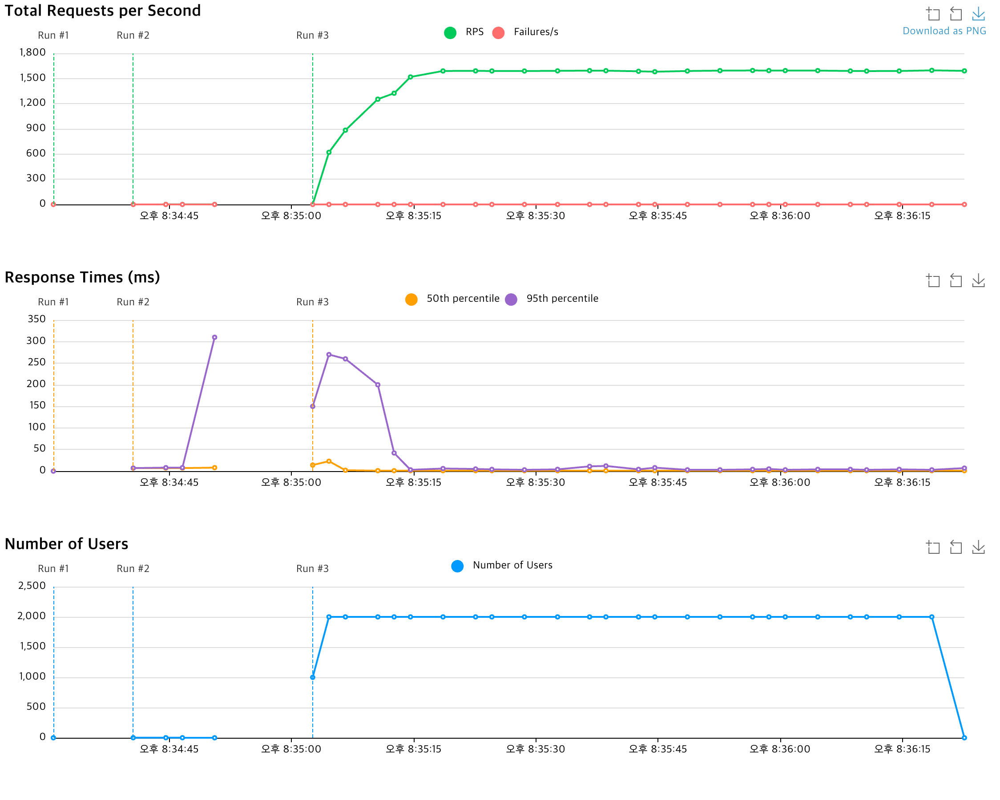

# 미니 프로젝트 기획서: 선착순 이벤트

## 1. 프로젝트 개요

- **이름**: 한정 수량 선착순 이벤트 서비스
- **목표**: 빠르게 구매가 완료되는 한정 수량 상품(이벤트 티켓, 한정판 굿즈 등)의 선착순 판매를 안정적으로 처리하며, Overselling을 방지하고 사용자 경험을 보장한다.
- **핵심 이슈**: 재고 관리, 동시성 제어, 트랜잭션 일관성, 이벤트성 트래픽 급증 대응

## 2. 요구사항

1. **선착순 구매 기능**
    - 이벤트 시작 시점에 한정된 수량(예: 100개)만 판매
    - 재고 소진 시 즉시 판매 종료
2. **동시성 제어**
    - 대량 동시 요청에도 Overselling 방지
3. **구매 결과 알림**
    - 구매 성공/실패 시 즉시 응답
4. **실패 가능성**
    - 잔고가 없는 경우 실패 가능 ( 전체 요청 중 10% 확률로 발생 )
5. **장애 대응**
    - 재시도 로직 및 실패 시 롤백
    - 시스템 부하 시 대기열 처리

## 3. 주요 기능 명세

| 기능         | 설명                                         |
|------------|--------------------------------------------|
| 이벤트 시작/종료  | 관리자 API로 이벤트 생성 및 시작, 종료                   |
| 재고 초기화     | 이벤트 시작 시 Redis 카운터에 재고 수량 설정               |
| 선착순 구매 API | 사용자 요청 시 Redis 카운터에서 재고 차감 → DB 주문 테이블에 기록 |
| 주문 처리      | 동기 또는 비동기(Kafka) 방식으로 주문 확정 처리             |
| 구매 결과 알림   | API 응답 또는 WebSocket으로 구매 성공/실패 알림          |
| 통계 집계      | Redis 또는 DB에서 요청/성공/실패 집계                  |
| 재시도 및 롤백   | 주문 처리 실패 시 Redis 재고 복구, DB 트랜잭션 롤백         |

## 생각해 볼 것

- fallback 전략
    - [x] OrderEvent 발행 실패 전략 -> 프로듀서쪽에 retry 관련 설정
    - [x] OrderEvent 처리 실패 전략 -> 컨슈머쪽에 (DLT, Backoff)
- [x] 이미 주문 이력이 있는 UUID의 중복 구매 방지 전략 (Redis 활용? 아니면 DB?)
- [x] Redis를 활용한 재고 관리 전략 (Lua 스크립트? 아니면 Atomic Operation?)

## 설계


### 1. Validation 검증

사용자 정보에 따라 특정 사용자는 구매에 실패하는 경우가 있다.

- 위 경우를 시뮬레이션 하기 위해 10% 확률로 실패하는 validation service가 존재한다.
- 혹은 구매성공 이력이 존재하는 경우에는 재시도했을 경우 항상 실패한다.

### 2. redis를 활용한 재고 차감

- 재고를 관리하기 위한 용도로 Reids를 활용한다.
- Lua 스크립트를 활용하면 원자적 연산이 가능하고 Redis 내에서 순차적으로 처리되기 때문에 동시성 처리에 적합하다고 판단하였다.
- 구매 성공 이력에 대한 판단도 Redis Lua 스크립트 내에서 처리하도록 한다. [(케이스1)](#1-이미-주문-이력이-있는-uuid의-중복-구매-방지-전략-redis-활용-아니면-db)

### 3. 주문 이력 이벤트 발행

- 주문이 성공하거나 실패할 경우 이벤트를 발행한다.

### 4. 주문 이력 이벤트 처리

- 주문 이력 이벤트를 받아 처리할 수 있도록 consumer를 구현한다.

### 5. 주문 성공/실패 응답

- 주문 성공/실패 여부를 사용자에게 응답한다.

---

## 케이스 정리

### 1. 이미 주문 이력이 있는 UUID의 중복 구매 방지 전략 (Redis 활용? 아니면 DB?)

❌ ValidationService에서 구매이력 DB를 읽어 처리하도록 한다.


- 검증을 ValidationService에서 RDB를 바라보고 처리하다 보니 RDB에 구매이력 반영에 대한 시간 지연으로 인한 2회 성공이 발생가능했다. (따당이슈)

✅ LuaScript 에 구매이력 검증까지 처리하도록 한다.


- 원자성을 보장하는 Lua Script를 통해서 재고를 해당 회원이 구매이력이 존재하는지 까지 관리를 하도록 처리한다. => atomic 하게 이력 검사 및 재고 차감이 가능해짐

### Kafka DLT

```java
DeadLetterPublishingRecoverer recoverer = new DeadLetterPublishingRecoverer(kafkaTemplate,
    (record, exception) -> {
        return new TopicPartition(record.topic() + ".DLT", record.partition()); // DLT 파티션이 2개 이상이면 0번 파티션에만 이벤트가 쏠리니까 이건 좀 위험하지 않을까?
        return new TopicPartition(record.topic() + ".DLT", 0); // DLT 파티션이 2개 이상이면 0번 파티션에만 이벤트가 쏠리니까 이건 좀 위험하지 않을까?
        return new TopicPartition(record.topic() + ".DLT", -1); // 원본 토픽 파티션을 아무리 늘려도 DLT 파티션은 신경 안써도 된다. 알아서 파티션에 잘 분배 되어 이벤트가 들어간다.
    });
```

- 원본 토픽에서 컨슘에 3번 실패한 경우 DLT로 발행된다.
- 3번 처리에 실패했다는 것은 일반적이지 않은 메시지이거나, 상황일 수 있으므로 DLT는 실시간으로 컨슘하지 않는다.
- DLT는 별도의 배치 잡 등으로 처리한다.

### Kafka 메세지 발행을 비동기로 처리하면 성능이 빠를 것이다.

- 1000명의 사용자가 총 10000개의 요청을 날렸을 때 모든 요청을 처리하는데 16초가 걸림
- 카프카 메세지 발송을 하는 것 자체를 비동기로 


---

## 테스트

### 테스트 파이썬 스크립트 실행 방법

1. docker-compose 를 띄운다
2. 테스트 스크립트를 실행한다.
3. redis에 재고가 잘 들어갔는지 확인한다.
4. Enter를 눌러서 테스트 실행한다.
5. 테스트 결과를 확인한다.

**도커 실행 커멘드**

```bash
docker-compose -p flash-sale -f docker/docker-compose.yml up -d
```

**실행 커멘드**

```bash
python3 script/concurrency_test.py
```

**정합성 테스트 결과**

```bash
서버 저장소를 초기화합니다...
저장소 초기화: 성공

상품 재고를 설정합니다...

상품 설정이 완료되었습니다. 설정을 확인한 후 테스트를 시작하려면 Enter 키를 누르세요...


테스트에 사용할 1000명의 사용자가 생성되었습니다.
총 10000개의 주문 요청을 전송합니다.
동시에 주문 API 요청을 시작합니다...
모든 요청 완료: 16.87초 소요됨
성공 응답: 10000/10000

상품별 요청 통계:
- 테스트상품1: 성공: 100 | 실패: 2452 | 총 요청: 2552
- 아이폰15: 성공: 100 | 실패: 2412 | 총 요청: 2512
- 테스트상품2: 성공: 100 | 실패: 2342 | 총 요청: 2442
- 갤럭시S24: 성공: 100 | 실패: 2394 | 총 요청: 2494

DB에 데이터가 적재될 때까지 3초 대기 중...

서버에서 각 상품별 주문 성공 횟수를 조회합니다...
상품 '테스트상품1' 주문 성공 횟수: 100
상품 '테스트상품2' 주문 성공 횟수: 100
상품 '아이폰15' 주문 성공 횟수: 100
상품 '갤럭시S24' 주문 성공 횟수: 100
```


**성능 테스트 결과**


- RPS : 1591.1
- p95 : 15ms
- p99 140ms
