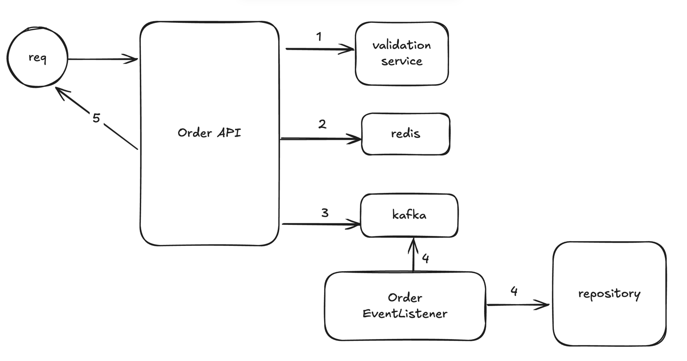
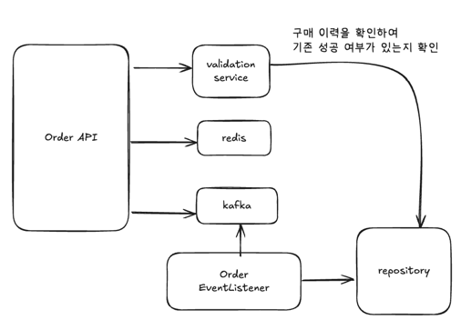
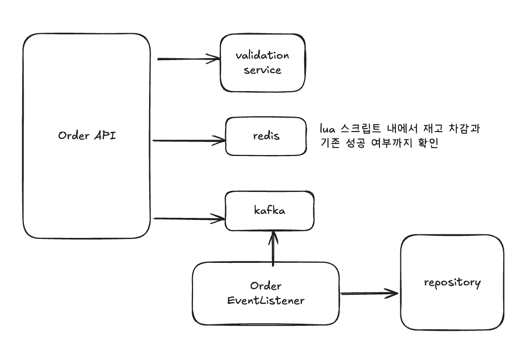

# 미니 프로젝트 기획서: 선착순 이벤트

## 1. 프로젝트 개요
- **이름**: 한정 수량 선착순 이벤트 서비스
- **목표**: 빠르게 구매가 완료되는 한정 수량 상품(이벤트 티켓, 한정판 굿즈 등)의 선착순 판매를 안정적으로 처리하며, Overselling을 방지하고 사용자 경험을 보장한다.
- **핵심 이슈**: 재고 관리, 동시성 제어, 트랜잭션 일관성, 이벤트성 트래픽 급증 대응

## 2. 요구사항
1. **선착순 구매 기능**
   - 이벤트 시작 시점에 한정된 수량(예: 100개)만 판매
   - 재고 소진 시 즉시 판매 종료
2. **동시성 제어**
   - 대량 동시 요청에도 Overselling 방지
3. **구매 결과 알림**
   - 구매 성공/실패 시 즉시 응답
4. **실패 가능성**
   - 잔고가 없는 경우 실패 가능 ( 전체 요청 중 10% 확률로 발생 )
5. **장애 대응**
   - 재시도 로직 및 실패 시 롤백
   - 시스템 부하 시 대기열 처리

## 3. 주요 기능 명세
| 기능                  | 설명                                                                 |
|---------------------|--------------------------------------------------------------------|
| 이벤트 시작/종료       | 관리자 API로 이벤트 생성 및 시작, 종료                                |
| 재고 초기화            | 이벤트 시작 시 Redis 카운터에 재고 수량 설정                           |
| 선착순 구매 API        | 사용자 요청 시 Redis 카운터에서 재고 차감 → DB 주문 테이블에 기록       |
| 주문 처리             | 동기 또는 비동기(Kafka) 방식으로 주문 확정 처리                         |
| 구매 결과 알림         | API 응답 또는 WebSocket으로 구매 성공/실패 알림                        |
| 통계 집계             | Redis 또는 DB에서 요청/성공/실패 집계                                 |
| 재시도 및 롤백         | 주문 처리 실패 시 Redis 재고 복구, DB 트랜잭션 롤백                      |

## 생각해 볼 것
- fallback 전략
  - [x] OrderEvent 발행 실패 전략 -> 프로듀서쪽에 retry 관련 설정
  - [ ] OrderEvent 처리 실패 전략 -> 컨슈머쪽에 (DLT, Backoff)
- [x] 이미 주문 이력이 있는 UUID의 중복 구매 방지 전략 (Redis 활용? 아니면 DB?)
- [x] Redis를 활용한 재고 관리 전략 (Lua 스크립트? 아니면 Atomic Operation?)

##  설계

### 1. Validation 검증
사용자 정보에 따라 특정 사용자는 구매에 실패하는 경우가 있다.
  - 위 경우를 시뮬레이션 하기 위해 10% 확률로 실패하는 validation service가 존재한다.
  - 혹은 구매성공 이력이 존재하는 경우에는 재시도했을 경우 항상 실패한다.

### 2. redis를 활용한 재고 차감
- 재고를 관리하기 위한 용도로 Reids를 활용한다.
- Lua 스크립트를 활용하면 원자적 연산이 가능하고 Redis 내에서 순차적으로 처리되기 때문에 동시성 처리에 적합하다고 판단하였다.
- 구매 성공 이력에 대한 판단도 Redis Lua 스크립트 내에서 처리하도록 한다. [(케이스1)](#1-이미-주문-이력이-있는-uuid의-중복-구매-방지-전략-redis-활용-아니면-db)

### 3. 주문 이력 이벤트 발행
- 주문이 성공하거나 실패할 경우 이벤트를 발행한다.

### 4.  주문 이력 이벤트 처리
- 주문 이력 이벤트를 받아 처리할 수 있도록 consumer를 구현한다.

### 5. 주문 성공/실패 응답
- 주문 성공/실패 여부를 사용자에게 응답한다.

---

## 케이스 정리

### 1. 이미 주문 이력이 있는 UUID의 중복 구매 방지 전략 (Redis 활용? 아니면 DB?)
❌ ValidationService에서 구매이력 DB를 읽어 처리하도록 한다.

- 검증을 ValidationService에서 RDB를 바라보고 처리하다 보니 RDB에 구매이력 반영에 대한 시간 지연으로 인한 2회 성공이 발생가능했다. (따당이슈)

✅ LuaScript 에 구매이력 검증까지 처리하도록 한다.

- 원자성을 보장하는 Lua Script를 통해서 재고를 해당 회원이 구매이력이 존재하는지 까지 관리를 하도록 처리한다. => atomic 하게 이력 검사 및 재고 차감이 가능해짐

